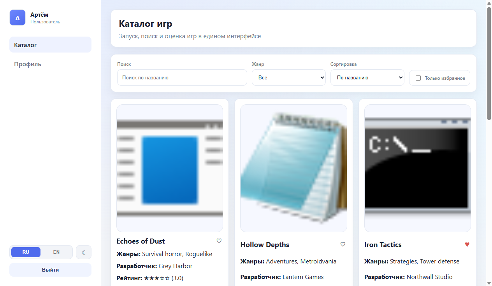
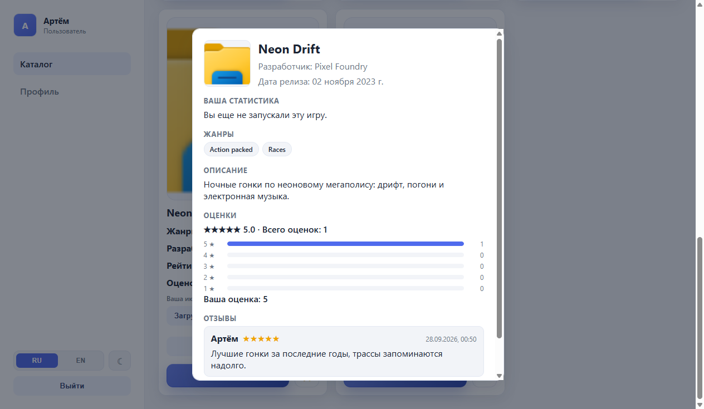
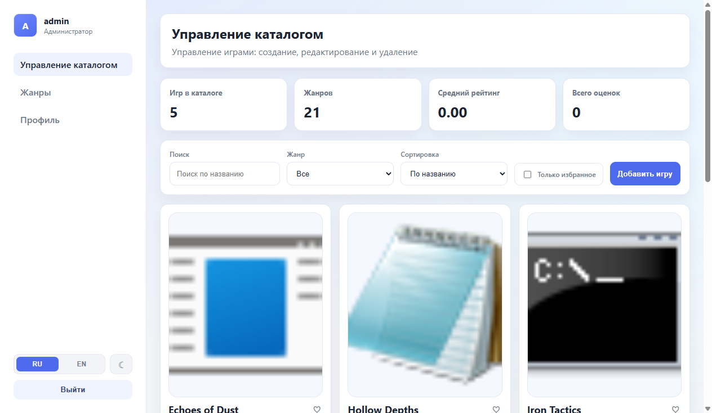
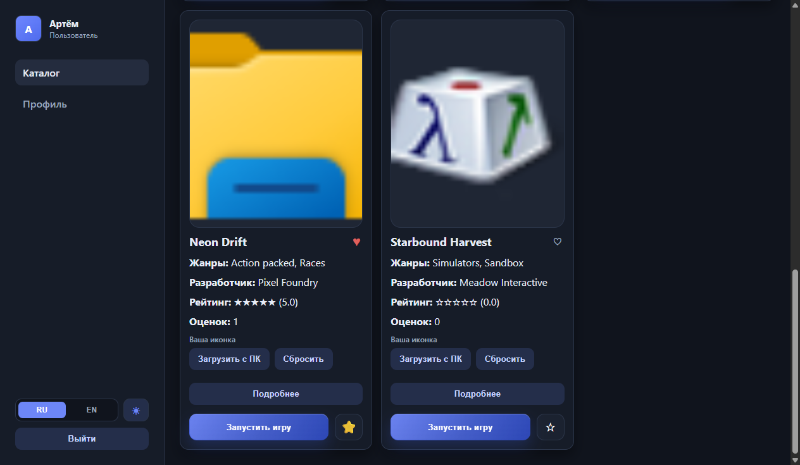

# Game Catalog

A desktop app for managing a game library. Users can launch games straight from the catalog, rate them, customize icons and edit their profile. An administrator manages the catalog and genres.

[](https://github.com/HeaDBlasteR/Game-catalog/actions/workflows/ci.yml)

Built with **Electron + React + TypeScript**. Data is stored locally in **SQLite** via **TypeORM**.

The interface is available in English and Russian, in a light and a dark theme, and both can be switched at any time.

## Screenshots

| Catalog | Game details |
| --- | --- |
|  |  |

| Catalog management | Dark theme |
| --- | --- |
|  |  |

## Features

### User

- sign up and log in (passwords are hashed with bcrypt);
- browse the catalog with search by title, filter by genre and favorites, and sorting by title, rating, playtime, last played or date added;
- mark games as favorites;
- launch a game with one click; after the game exits, the app offers to rate it;
- track playtime, launch count and the last played date per game;
- open a details window with the description, release date, genres, personal stats, a breakdown of ratings and all reviews;
- rate games from 1 to 5 stars with an optional written review, with the average rating recalculated automatically;
- set a personal icon for any game, visible only to that user;
- edit the profile: nickname, email, phone number with a `+7 (XXX) XXX-XX-XX` mask, avatar;
- change the account password;
- switch the interface language between English and Russian and toggle the dark theme; both choices are remembered.

### Administrator

- add, edit and delete games (title, developer, release date, path to the executable, description, icon, multiple genres);
- pick the game executable in a file dialog; its icon is extracted from the file automatically;
- manage genres; a starter set of 21 genres is created on first launch;
- view catalog statistics: number of games and genres, average rating, total number of ratings.

## Tech stack

| Layer | Technologies |
| --- | --- |
| Shell | Electron 41 |
| UI | React 19, React Router 7, Vite 7 |
| Language | TypeScript 5 |
| Data | SQLite (sqlite3), TypeORM 0.3 |
| Other | bcrypt, concurrently, wait-on, cross-env |

## Architecture

The app runs in two processes:

- **Main process** (`electron/`) handles the database, the file system and launching games. IPC handlers are grouped by area: `auth`, `games`, `genres`, `ratings`, `admin`. The current user is kept in a session in the main process and identified by the window that sent the request.
- **Renderer** (`src/`) is the React UI. It has no direct access to Node.js and talks to the main process only through the `window.electronAPI` bridge exposed by the preload script.

```
electron/
  main.ts                 entry point, window creation, database initialization
  preload.ts              API exposed to the UI (contextBridge)
  data-source.ts          TypeORM connection
  database-service.ts     games, genres, ratings and icons
  session.ts              user session and permission checks
  ipc/                    IPC handlers
  services/               default genres
  i18n.ts                 translations for system dialogs
src/
  entities/               TypeORM entities: User, Game, Genre, UserRating, UserGameIcon, UserGameState
  pages/                  Catalog, Genres, Profile, Login, Register
  components/             game card, modals, notifications, layout
  contexts/AuthContext    authentication state
  i18n/                   translations and language context
  theme/                  light and dark theme context
  shared/                 shared types and error handling
tests/                    end-to-end tests driving the real app
```

## Getting started

Requires **Node.js 20.17+**.

```bash
npm install        # installs dependencies and rebuilds native modules for Electron
npm run dev        # development mode (Vite + Electron with hot reload)
```

Build and run the production version:

```bash
npm run build
npm start
```

## Development

```bash
npm run typecheck   # TypeScript checks for the renderer and the main process
npm test            # end-to-end tests (Windows only, see tests/README.md)
npm run dist        # Windows installer, written to release/
```

The end-to-end tests launch the real Electron app through Playwright and click through the UI:
authentication, the catalog, genres, ratings, reviews, favorites, the profile and both languages.
Every run uses a throwaway user-data directory, so your own database is never touched.

### Default login

An administrator account is created on first launch:

- username: `admin`
- password: `admin`

Regular users can sign up from the login screen.

### Database location

| Mode | File |
| --- | --- |
| `npm run dev` | `data.db` in the project root |
| `npm start` | `%APPDATA%\game-catalog\data.db` |

The schema is created automatically on startup. To browse the database, use the [SQLite Viewer](https://marketplace.visualstudio.com/items?itemName=qwtel.sqlite-viewer) extension for VS Code or DB Browser for SQLite.

### Troubleshooting

If Electron fails with `Cannot read properties of undefined (reading 'whenReady')`, the `ELECTRON_RUN_AS_NODE` environment variable is set. Remove it and start the app again:

```powershell
Remove-Item Env:ELECTRON_RUN_AS_NODE
```
